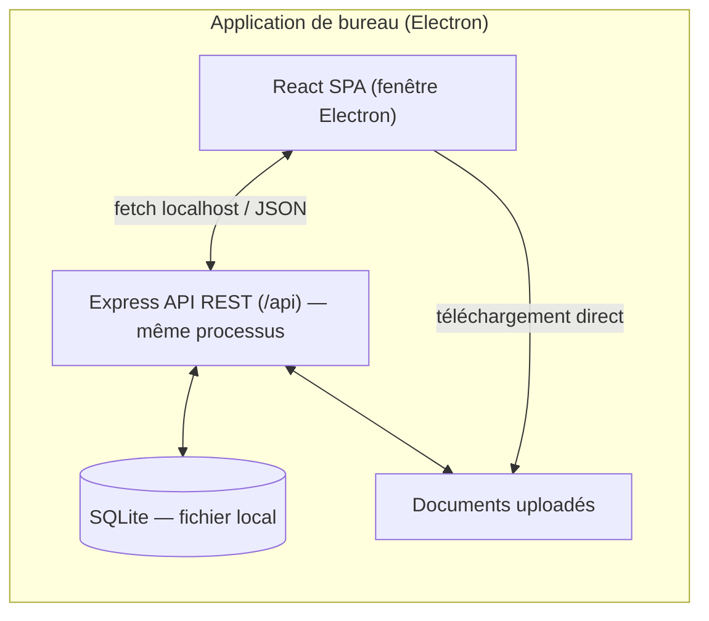

# GEPI — Gestion des EPI/EPC — ONEE Direction Transport Casablanca

Application de gestion du cycle de vie complet des équipements de protection
individuelle (EPI) et collective (EPC) : catalogue, marchés, organisation,
bénéficiaires, affectations, contrôles périodiques, alertes, historique et
rapports.

Livrée sous forme d'**application de bureau installable** (Windows, macOS,
Linux) : un seul programme à double-cliquer, sans PostgreSQL à installer, sans
terminal ni fichier `.env` à configurer. Les données réelles DTC (catalogue,
organigramme, agents, dotations) sont chargées automatiquement au premier
lancement, dans une base embarquée propre à l'utilisateur.

## 1. Ce qui est livré

| Domaine (cahier des charges) | Statut |
|---|---|
| Dashboard (KPI + 6 graphiques) | ✅ |
| Catalogue articles (tous les champs §4) | ✅ (structure) — voir note ci-dessous sur les champs non fournis |
| Marchés | ✅ (module fonctionnel, aucun marché fictif préchargé) |
| Bénéficiaires + organigramme Direction→Division→Service→Équipe | ✅ |
| Affectations nominatives et collectives, retours, réformes | ✅ |
| Historique append-only (aucune donnée supprimée) | ✅ |
| Contrôles périodiques + réparations + alertes automatiques | ✅ (module fonctionnel, aucune échéance fictive préchargée) |
| Documents (notices, certificats, photos…) | ✅ |
| Recherche avancée globale | ✅ |
| Rapports PDF (fiches individuelle/équipe) et Excel (7 états) | ✅ |
| Authentification | ✅ — compte unique, pas de gestion multi-utilisateurs (application à usage individuel) |
| Dark/Light mode, responsive, sidebar, recherche instantanée | ✅ |
| Base de données prête à l'emploi avec **données réelles DTC** | ✅ — chargée automatiquement au premier lancement |
| Schémas UML | ✅ en Mermaid (`docs/`), pas de fichiers `.vsdx`/`.png` séparés |
| Maquettes Figma | ❌ non produites — l'application fonctionnelle en tient lieu |
| Application de bureau installable (Windows/macOS/Linux) | ✅ Electron — voir §4 |
| Application mobile | ❌ hors périmètre — API REST déjà prête pour un client mobile (§8) |

### Provenance des données — ce qui est réel et ce qui ne l'est pas

Le catalogue (119 articles), l'organigramme (4 divisions, 11 services, 58
équipes), les 311 agents nominatifs et les gabarits de dotation standard par
type d'équipe proviennent **intégralement** des fichiers
`Dotation_EPI_EPC_DTC.xlsx`, `Affectation_Nominative_DTC.xlsx` et
`organigramme_dtc_membres_1.csv` fournis — rien n'y a été inventé ni estimé.

Ces fichiers ne contenaient en revanche **aucune donnée** sur les points
suivants ; plutôt que de les estimer, le chargement initial
(`server/seeds/seedData.ts`) les laisse volontairement vides ou à zéro, à
saisir dans l'application au fur et à mesure que les informations réelles
sont disponibles :

- **Prix unitaires, marchés, fournisseurs** des articles — le module Marchés
  est fonctionnel mais ne contient aucun marché tant que vous n'en créez pas.
- **Stock** (disponible, réservé, commandé, seuils min/max) — tous les
  articles démarrent à 0 ; les indicateurs de rupture/stock faible du
  dashboard reflètent donc « stock non encore inventorié », pas un incident.
- **Dates de fabrication, durée de vie, date limite d'utilisation, garantie**
  des articles.
- **Date réelle de remise, taille et pointure** de chaque dotation
  individuelle (les 7136 lignes d'affectation générées depuis les gabarits
  sont réelles — « cet agent a bien reçu cet article » — seule la date exacte
  et la taille/pointure individuelles ne sont pas documentées dans les
  sources).
- **Contrôles périodiques planifiés** (inspections, essais diélectriques,
  étalonnages) — le module est fonctionnel mais ne contient aucune échéance
  tant que le responsable HSE n'en a pas saisi.
- **Téléphone, date d'embauche, photo** des agents.

En résumé : la structure organisationnelle et le contenu des dotations sont
réels et exhaustifs ; tout ce qui relève de la gestion opérationnelle courante
(prix, stock, échéances, coordonnées) est un formulaire vide prêt à être
rempli avec vos données réelles, pas une simulation.

## 2. Stack technique

- **Frontend** : React 18 + TypeScript + Vite + React Router 6 + TailwindCSS 3 + Radix UI + Recharts + TanStack Query
- **Backend** : Express 5 + TypeScript, API REST sous `/api`
- **Base de données** : SQLite embarqué (fichier local, `better-sqlite3`) + Drizzle ORM (migrations versionnées, appliquées automatiquement au démarrage)
- **Bureau** : Electron — le serveur Express tourne dans le même processus et sert l'interface dans une fenêtre native ; aucune installation séparée (pas de PostgreSQL, pas de Node.js requis pour l'utilisateur final)
- **Authentification** : JWT + bcrypt, compte unique (application à usage individuel, pas de gestion multi-comptes/rôles)
- **Documents** : upload via Multer, stockage sur disque (dossier de données de l'application)
- **Rapports** : PDFKit (fiches PDF) + ExcelJS (exports Excel)

## 3. Architecture



Base de données, documents uploadés et fichier de configuration vivent tous
dans le dossier de données de l'utilisateur (`app.getPath('userData')` côté
Electron), créés et initialisés automatiquement au premier lancement — voir
§4. Voir `docs/architecture.md` pour le détail des modules serveur,
`docs/erd.md` pour le schéma de base de données complet et
`docs/sequence-diagrams.md` pour les flux métier clés (dotation, application
d'un gabarit standard, retour).

## 4. Installation

### Utilisateur final — application de bureau

1. Récupérer l'installateur correspondant à votre système depuis les
   [Releases GitHub](../../releases) du dépôt (`GEPI-Setup-x.y.z.exe` pour
   Windows, `.dmg` pour macOS, `.AppImage` pour Linux) — produits
   automatiquement par le flux `epi-epc-build` (voir §7).
2. L'installer / le lancer comme n'importe quel logiciel de bureau.
3. Au premier lancement, l'application crée automatiquement sa base de
   données et charge les données réelles DTC (catalogue, organigramme, 311
   agents, gabarits de dotation) — aucune saisie ni configuration requise.
4. Se connecter avec le compte de démonstration (voir ci-dessous), puis le
   changer avant tout usage réel.

Aucune installation de Node.js, PostgreSQL, ni configuration de fichier
`.env` n'est nécessaire : tout est embarqué dans l'application.

### Développeurs — lancer depuis les sources

```bash
cd epi-epc-app
pnpm install

# Développement (rechargement à chaud, base SQLite auto-créée dans ./data)
pnpm dev

# Ou : build + lancement en tant qu'app Electron locale
pnpm build
pnpm electron

# Ou : build + lancement en mode serveur web classique (sans Electron)
pnpm build
pnpm start
# → GEPI écoute sur http://localhost:8080
```

Les migrations Drizzle (`server/db/migrations/`) sont appliquées
automatiquement au démarrage ; il n'y a rien à exécuter manuellement (pas de
`db:push` requis). `pnpm db:seed` reste disponible en développement pour
réinitialiser complètement la base avec des données fraîches (⚠️ supprime les
données existantes) — l'application elle-même ne réinitialise jamais une base
existante.

### Compte de démonstration

Application à usage individuel : un seul compte, sans gestion de rôles.

| Identifiant | Mot de passe |
|---|---|
| `admin` | `Admin@2026` |

**Changez ce mot de passe avant tout usage réel.** Il n'y a pas de page dédiée
(pas de gestion multi-comptes) ; le plus simple est un petit script ponctuel,
à exécuter avec le même `DATA_DIR` que l'application (le dossier de données
Electron par défaut : `%APPDATA%/epi-epc-dtc` sur Windows,
`~/Library/Application Support/epi-epc-dtc` sur macOS, `~/.config/epi-epc-dtc`
sur Linux) :

```bash
cd epi-epc-app
DATA_DIR="<dossier-de-données-ci-dessus>" node -e "
const bcrypt = require('bcryptjs');
const path = require('node:path');
const Database = require('better-sqlite3');
const db = new Database(path.join(process.env.DATA_DIR, 'data', 'gepi.db'));
const hash = bcrypt.hashSync('VotreNouveauMotDePasse', 10);
db.prepare('UPDATE users SET password_hash = ? WHERE username = ?').run(hash, 'admin');
db.close();
"
```

### Sauvegardes

Toutes les données (base SQLite + documents uploadés) vivent dans le dossier
de données de l'application ci-dessus. Sauvegarder ce dossier régulièrement
(copie de fichier simple — pas d'outil de dump requis) suffit à protéger
l'ensemble des données métier.

## 5. Scripts disponibles

| Commande | Effet |
|---|---|
| `pnpm dev` | Serveur de développement (client + API, port 8080, base SQLite dans `./data`) |
| `pnpm build` | Build production (client + serveur), copie les migrations/fixtures dans `dist/server/` |
| `pnpm start` | Démarre l'application construite en serveur web (sans Electron) |
| `pnpm electron` | Lance l'application construite dans une fenêtre Electron locale |
| `pnpm electron:dist` | Build complet + génère l'installateur de bureau (`dist-electron/`) |
| `pnpm db:generate` | Génère une migration Drizzle à partir de `schema.ts` |
| `pnpm db:studio` | Interface d'administration de la base (Drizzle Studio) |
| `pnpm db:seed` | Réinitialise et recharge les données réelles DTC (⚠️ supprime les données existantes — dev uniquement) |
| `pnpm typecheck` | Vérification TypeScript |
| `pnpm test` | Tests unitaires (Vitest, base SQLite isolée en mémoire) |

## 6. Structure du projet

```
client/                  SPA React
  pages/                 Une page par module (Dashboard, Articles, Agents…)
  components/ui/          Bibliothèque de composants (boutons, tables, dialogues…)
  components/layout/       Sidebar, header, coquille de page
  components/shared/       StatCard, badges de statut
  lib/                     API client, auth, thème, utilitaires
server/
  db/schema.ts             Schéma Drizzle (source de vérité de la base)
  db/index.ts              Connexion SQLite (better-sqlite3)
  db/migrate.ts            Application des migrations au démarrage
  db/bootstrap.ts          Initialisation automatique (migrations + seed si base vide)
  db/migrations/           Migrations SQL versionnées (générées par drizzle-kit)
  routes/                  Un routeur Express par domaine
  services/                Logique réutilisable (stock, alertes, PDF, historique)
  seeds/                   Données réelles DTC + script de chargement
electron/main.cjs          Processus principal Electron (démarre le serveur + fenêtre)
shared/api.ts              Types partagés client/serveur
docs/                      Schémas UML (Mermaid) et notes d'architecture
```

## 7. Application de bureau (Electron)

Le fichier `electron/main.cjs` démarre le serveur Express du même processus
(`dist/server/node-build.js`) avec `DATA_DIR` pointant vers
`app.getPath('userData')`, puis ouvre une fenêtre chargeant
`http://localhost:8080`. Aucun IPC ni preload spécifique n'est nécessaire :
l'interface communique avec l'API comme n'importe quelle page web (fetch +
JWT).

Le flux GitHub Actions `.github/workflows/epi-epc-build.yml` construit
automatiquement les trois installateurs (Windows `.exe` via NSIS, macOS
`.dmg`, Linux `.AppImage`) sur les runners natifs correspondants — nécessaire
car un module natif (`better-sqlite3`) doit être compilé pour chaque
plateforme cible. Un tag `epi-epc-v*` publie ces installateurs comme
GitHub Release. En local, `pnpm electron:dist` produit un installateur pour
la plateforme courante uniquement, dans `dist-electron/`.

## 8. Évolutivité mobile

Toute la logique métier passe par l'API REST `/api/*` (JSON, JWT). Une
application mobile (React Native, Flutter…) peut consommer directement les
mêmes endpoints que le frontend web — aucune duplication de logique serveur
n'est nécessaire pour l'ajouter ultérieurement. Une synchronisation temps réel
(WebSocket/SSE) pourrait être ajoutée sur `server/index.ts` sans remise en
cause du schéma de données.

## 9. Sécurité

- Mots de passe hachés (bcrypt), sessions par JWT signé (12h), aucune route
  API sensible accessible sans jeton valide.
- Aucune suppression physique des données métier (agents archivés, articles
  désactivés, historique immuable) — traçabilité complète.
- L'API n'écoute que sur `localhost` depuis la fenêtre Electron de
  l'utilisateur (application de bureau à usage individuel, pas un service
  réseau exposé) ; penser malgré tout à changer le mot de passe de
  démonstration avant tout usage réel (voir §4).
