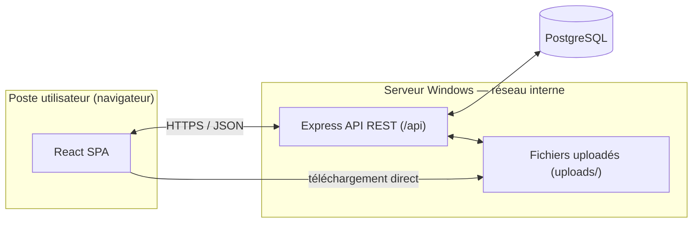

# GEPI — Gestion des EPI/EPC — ONEE Direction Transport Casablanca

Application de gestion du cycle de vie complet des équipements de protection
individuelle (EPI) et collective (EPC) : catalogue, marchés, organisation,
bénéficiaires, affectations, contrôles périodiques, alertes, historique et
rapports.

Construite avec la même stack que l'application sœur de gestion des
habilitations de la DTC, pour rester cohérente avec l'existant et fonctionner
comme un logiciel métier — pas un fichier Excel — accessible depuis n'importe
quel poste Windows via un navigateur, sur le réseau interne.

## 1. Ce qui est livré

| Domaine (cahier des charges) | Statut |
|---|---|
| Dashboard (KPI + 6 graphiques) | ✅ |
| Catalogue articles (tous les champs §4) | ✅ (structure) — voir note ci-dessous sur les champs non fournis |
| Marchés | ✅ (module fonctionnel, aucun marché fictif préchargé) |
| Bénéficiaires + organigramme Direction→Division→Service→Équipe | ✅ |
| Affectations nominatives et collectives, retours, réformes | ✅ |
| Historique append-only (aucune donnée supprimée) | ✅ |
| Contrôles périodiques + réparations + alertes automatiques | ✅ (module fonctionnel, aucune échéance fictive préchargée) |
| Documents (notices, certificats, photos…) | ✅ |
| Recherche avancée globale | ✅ |
| Rapports PDF (fiches individuelle/équipe) et Excel (7 états) | ✅ |
| Comptes utilisateurs + rôles | ✅ |
| Dark/Light mode, responsive, sidebar, recherche instantanée | ✅ |
| Base de données prête à l'emploi avec **données réelles DTC** | ✅ |
| Schémas UML | ✅ en Mermaid (`docs/`), pas de fichiers `.vsdx`/`.png` séparés |
| Maquettes Figma | ❌ non produites — l'application fonctionnelle en tient lieu |
| Exécutable Windows autonome | ❌ non compilé ici — voir §7 pour la voie Electron |
| Application mobile | ❌ hors périmètre — API REST déjà prête pour un client mobile (§8) |

### Provenance des données — ce qui est réel et ce qui ne l'est pas

Le catalogue (119 articles), l'organigramme (4 divisions, 11 services, 58
équipes), les 311 agents nominatifs et les gabarits de dotation standard par
type d'équipe proviennent **intégralement** des fichiers
`Dotation_EPI_EPC_DTC.xlsx`, `Affectation_Nominative_DTC.xlsx` et
`organigramme_dtc_membres_1.csv` fournis — rien n'y a été inventé ni estimé.

Ces fichiers ne contenaient en revanche **aucune donnée** sur les points
suivants ; plutôt que de les estimer, le seed (`server/seeds/run.ts`) les
laisse volontairement vides ou à zéro, à saisir dans l'application au fur et
à mesure que les informations réelles sont disponibles :

- **Prix unitaires, marchés, fournisseurs** des articles — le module Marchés
  est fonctionnel mais ne contient aucun marché tant que vous n'en créez pas.
- **Stock** (disponible, réservé, commandé, seuils min/max) — tous les
  articles démarrent à 0 ; les indicateurs de rupture/stock faible du
  dashboard reflètent donc « stock non encore inventorié », pas un incident.
- **Dates de fabrication, durée de vie, date limite d'utilisation, garantie**
  des articles.
- **Date réelle de remise, taille et pointure** de chaque dotation
  individuelle (les 7136 lignes d'affectation générées depuis les gabarits
  sont réelles — « cet agent a bien reçu cet article » — seule la date exacte
  et la taille/pointure individuelles ne sont pas documentées dans les
  sources).
- **Contrôles périodiques planifiés** (inspections, essais diélectriques,
  étalonnages) — le module est fonctionnel mais ne contient aucune échéance
  tant que le responsable HSE n'en a pas saisi.
- **Téléphone, date d'embauche, photo** des agents.

En résumé : la structure organisationnelle et le contenu des dotations sont
réels et exhaustifs ; tout ce qui relève de la gestion opérationnelle courante
(prix, stock, échéances, coordonnées) est un formulaire vide prêt à être
rempli avec vos données réelles, pas une simulation.

## 2. Stack technique

- **Frontend** : React 18 + TypeScript + Vite + React Router 6 + TailwindCSS 3 + Radix UI + Recharts + TanStack Query
- **Backend** : Express 5 + TypeScript, API REST sous `/api`
- **Base de données** : PostgreSQL + Drizzle ORM (migrations versionnées)
- **Authentification** : JWT + bcrypt, rôles (administrateur, gestionnaire de stock, responsable HSE, chef d'équipe, consultation)
- **Documents** : upload via Multer, stockage sur disque (`uploads/`)
- **Rapports** : PDFKit (fiches PDF) + ExcelJS (exports Excel)
- **Un seul exécutable Node** sert à la fois l'API et l'interface — déployable sur un PC/serveur Windows du réseau interne, accessible par tous les postes via navigateur.

## 3. Architecture



Voir `docs/architecture.md` pour le détail des modules serveur, `docs/erd.md`
pour le schéma de base de données complet et `docs/sequence-diagrams.md` pour
les flux métier clés (dotation, application d'un gabarit standard, retour).

## 4. Installation (Windows / réseau interne)

### Prérequis
- Node.js 22 LTS ([nodejs.org](https://nodejs.org))
- PostgreSQL 16 ([postgresql.org](https://www.postgresql.org/download/windows/))
- pnpm : `npm install -g pnpm`

### Étapes

```bash
# 1. Récupérer le projet et installer les dépendances
cd epi-epc-app
pnpm install

# 2. Créer la base de données PostgreSQL
#    (via psql, pgAdmin, ou l'invite de commandes Windows)
createdb epi_epc_dtc

# 3. Configurer l'environnement
cp .env.example .env
# éditer .env : DATABASE_URL, JWT_SECRET (générer une longue chaîne aléatoire)

# 4. Créer les tables
pnpm db:push

# 5. Charger les données réelles DTC (catalogue, organigramme, agents, gabarits)
pnpm db:seed

# 6. Construire l'application
pnpm build

# 7. Démarrer en production
pnpm start
# → GEPI écoute sur http://<ip-du-serveur>:8080, accessible à tout le réseau interne
```

Pour le développement (rechargement à chaud) : `pnpm dev`.

### Comptes de démonstration (créés par `pnpm db:seed`)

| Identifiant | Mot de passe | Rôle |
|---|---|---|
| `admin` | `Admin@2026` | Administrateur |
| `magasinier` | `Stock@2026` | Gestionnaire de stock |
| `hse` | `Hse@2026` | Responsable HSE |
| `consultation` | `Lecture@2026` | Consultation |

**Changez ces mots de passe dès la mise en production** (page Utilisateurs).

### Sauvegardes

La base PostgreSQL est la source de vérité. Planifier une sauvegarde régulière
avec `pg_dump` (tâche planifiée Windows) ; le dossier `uploads/` (documents
joints) doit être sauvegardé de la même façon.

## 5. Scripts disponibles

| Commande | Effet |
|---|---|
| `pnpm dev` | Serveur de développement (client + API, port 8080) |
| `pnpm build` | Build production (client + serveur) |
| `pnpm start` | Démarre l'application construite |
| `pnpm db:push` | Applique le schéma Drizzle à la base |
| `pnpm db:studio` | Interface d'administration de la base (Drizzle Studio) |
| `pnpm db:seed` | Recharge les données de démonstration (⚠️ réinitialise les tables) |
| `pnpm typecheck` | Vérification TypeScript |
| `pnpm test` | Tests unitaires (Vitest) |

## 6. Structure du projet

```
client/                  SPA React
  pages/                 Une page par module (Dashboard, Articles, Agents…)
  components/ui/          Bibliothèque de composants (boutons, tables, dialogues…)
  components/layout/       Sidebar, header, coquille de page
  components/shared/       StatCard, badges de statut
  lib/                     API client, auth, thème, utilitaires
server/
  db/schema.ts             Schéma Drizzle (source de vérité de la base)
  routes/                  Un routeur Express par domaine
  services/                Logique réutilisable (stock, alertes, PDF, historique)
  seeds/                   Données réelles DTC + script de chargement
shared/api.ts              Types partagés client/serveur
docs/                      Schémas UML (Mermaid) et notes d'architecture
```

## 7. Vers un exécutable Windows autonome (non fait ici)

L'application sœur de gestion des habilitations empaquette déjà un flux
GitHub Actions Electron (`.github/workflows/build.yml`) pour produire un
`.exe`. Le même principe s'applique ici : envelopper `pnpm build` + `pnpm
start` dans une coquille Electron pointant vers `http://localhost:8080`. Ce
n'est pas fait dans cette livraison car une application web servie depuis un
poste du réseau interne couvre déjà l'exigence « fonctionne sur PC Windows /
réseau interne » sans installation sur chaque poste client — mais l'option
reste ouverte si un exécutable de bureau est requis.

## 8. Évolutivité mobile

Toute la logique métier passe par l'API REST `/api/*` (JSON, JWT). Une
application mobile (React Native, Flutter…) peut consommer directement les
mêmes endpoints que le frontend web — aucune duplication de logique serveur
n'est nécessaire pour l'ajouter ultérieurement. Une synchronisation temps réel
(WebSocket/SSE) pourrait être ajoutée sur `server/index.ts` sans remise en
cause du schéma de données.

## 9. Sécurité

- Mots de passe hachés (bcrypt), sessions par JWT signé (12h), aucune route
  API sensible accessible sans jeton valide.
- Rôles appliqués côté serveur (`requireRole`), pas seulement dans l'interface.
- Aucune suppression physique des données métier (agents archivés, articles
  désactivés, historique immuable) — traçabilité complète.
- Penser à changer `JWT_SECRET` et les mots de passe de démonstration avant
  toute mise en production, et à servir l'application en HTTPS derrière un
  reverse proxy si elle est exposée au-delà du réseau interne de confiance.
