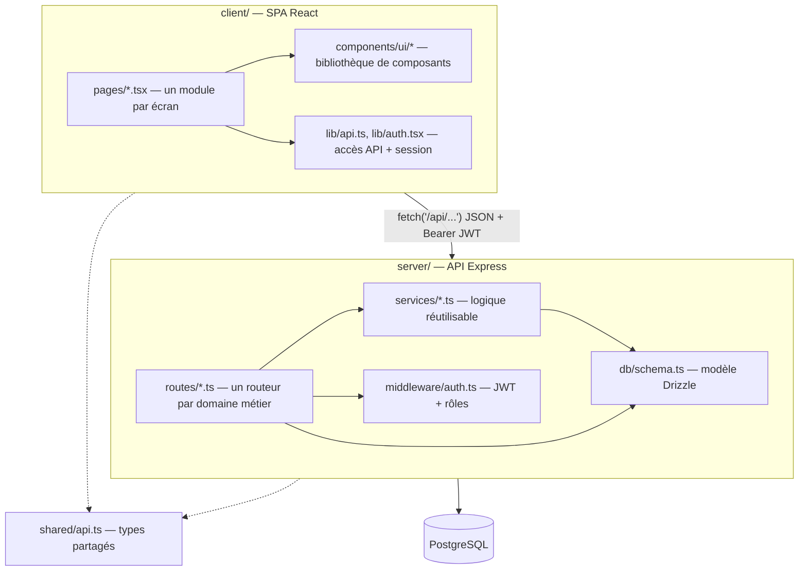

# Architecture

## Vue en couches

## Pourquoi cette organisation

- **Un routeur Express par domaine** (`agents.ts`, `articles.ts`,
  `affectations.ts`…) plutôt qu'un contrôleur monolithique : chaque fichier
  reste lisible et testable indépendamment, et correspond 1:1 à une section
  du cahier des charges.
- **Services partagés** (`stockService`, `alertService`, `historiqueService`,
  `pdfService`) pour ne pas dupliquer la logique de mouvement de stock ou de
  journalisation entre les routes qui en ont besoin (affectations, retours,
  réformes, seed).
- **`shared/api.ts`** évite la duplication de types entre client et serveur
  (rôles, formes de réponses du dashboard) — un changement de forme de
  réponse est détecté à la compilation des deux côtés.
- **Schéma Drizzle unique** (`server/db/schema.ts`) comme source de vérité :
  les migrations, le seed et les requêtes des routes en dérivent tous, plutôt
  que de maintenir des DTO séparés.

## Cycle de vie d'une requête authentifiée

1. Le client attache le JWT (`Authorization: Bearer <token>`) à chaque appel
   (`client/lib/api.ts`).
2. `server/index.ts` applique `requireAuth` à tous les routeurs sauf
   `/api/auth`. Un jeton absent ou invalide renvoie 401 et le client redirige
   vers `/login`.
3. Certaines routes (ex. gestion des utilisateurs) exigent en plus
   `requireRole("administrateur")` — un rôle insuffisant renvoie 403.
4. Le routeur exécute la requête Drizzle, éventuellement via un service
   partagé (mise à jour de stock, génération PDF/Excel, journalisation).
5. Toute mutation de données métier passe par `logHistorique(...)` pour
   alimenter le journal d'audit append-only.

## Extensibilité

- **Mobile** : consommer directement les mêmes routes `/api/*` (voir README
  §8) — aucune logique serveur dupliquée à prévoir.
- **Nouveau module** : ajouter une table dans `schema.ts`, un routeur dans
  `routes/`, le monter dans `server/index.ts`, et une page dans
  `client/pages/` + une entrée dans `client/components/layout/Sidebar.tsx`.
- **Nouvelle famille d'équipement** (ex. matériel EPI spécifique à une autre
  direction) : il suffit d'ajouter une ligne dans la table `familles` et,
  éventuellement, un nouveau `kit_template` — aucun changement de code n'est
  nécessaire pour cataloguer un nouveau type d'article.
