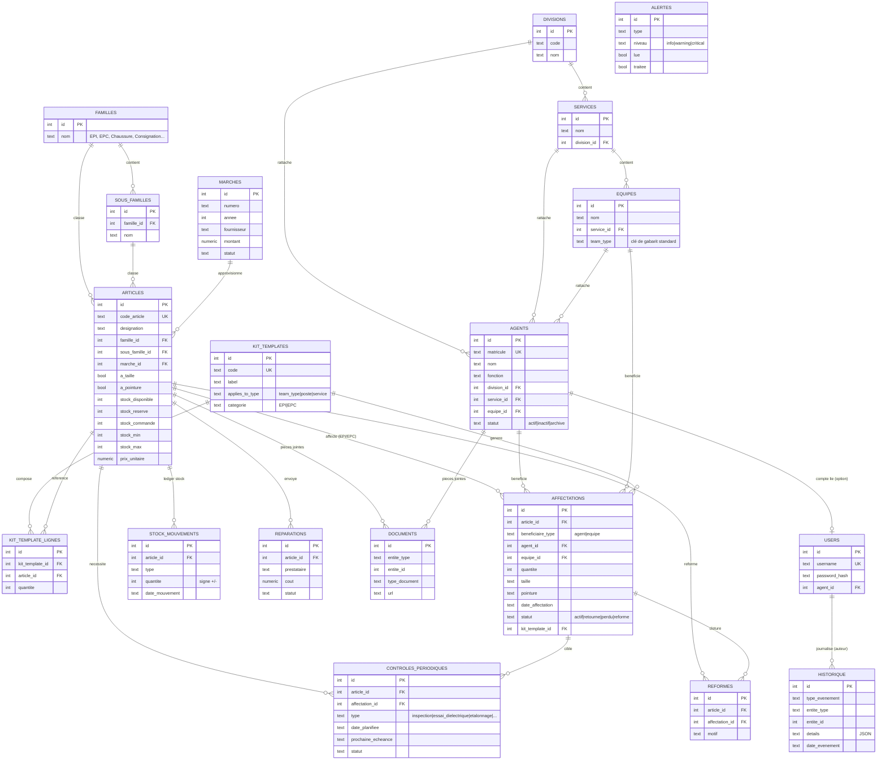

# Modèle de données (ERD)

Schéma entité-association complet. La source de vérité est le fichier
`server/db/schema.ts` (Drizzle ORM) — ce diagramme en est la représentation
visuelle, tenue à jour manuellement.

## Principes de conception

- **`historique` est append-only** : aucune route API ne fait d'UPDATE/DELETE
  dessus. C'est le journal d'audit exigé par le cahier des charges
  (§10 — « aucune donnée ne doit être supprimée »).
- **`stock_mouvements` est un ledger** : chaque entrée/sortie de stock est une
  ligne immuable ; `articles.stock_disponible` est un compteur dérivé
  maintenu en transaction à chaque mouvement (lecture rapide côté dashboard,
  traçabilité complète côté ledger).
- **`kit_templates` / `kit_template_lignes`** encodent le panier de dotation
  standard par type d'équipe (Équipe Lignes, TST Postes…) ou par poste
  (Directeur, Chef de Division…), extrait des fichiers `Dotation_EPI_EPC_DTC`.
  Appliquer un gabarit à un agent ou une équipe génère automatiquement les
  lignes d'`affectations` correspondantes.
- **Aucune suppression physique** : agents archivés (`statut='archive'`),
  articles désactivés (`actif=false`), jamais de `DELETE` sur les entités
  métier.
