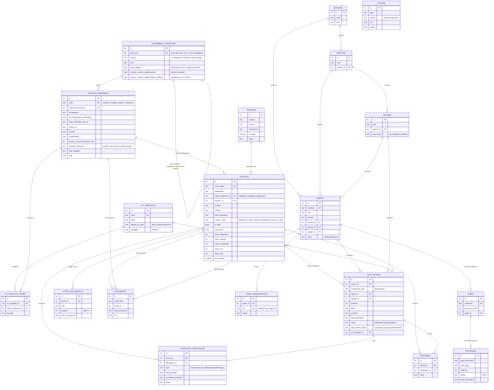

# Modèle de données (ERD)

Schéma entité-association complet. La source de vérité est le fichier
`server/db/schema.ts` (Drizzle ORM) — ce diagramme en est la représentation
visuelle, tenue à jour manuellement.

## Principes de conception

- **`historique` est append-only** : aucune route API ne fait d'UPDATE/DELETE
  dessus. C'est le journal d'audit exigé par le cahier des charges
  (§10 — « aucune donnée ne doit être supprimée »).
- **`stock_mouvements` est un ledger** : chaque entrée/sortie de stock est une
  ligne immuable ; `articles.stock_disponible` est un compteur dérivé
  maintenu en transaction à chaque mouvement (lecture rapide côté dashboard,
  traçabilité complète côté ledger).
- **`kit_templates` / `kit_template_lignes`** encodent le panier de dotation
  standard par type d'équipe (Équipe Lignes, TST Postes…) ou par poste
  (Directeur, Chef de Division…), extrait des fichiers `Dotation_EPI_EPC_DTC`.
  Appliquer un gabarit à un agent ou une équipe génère automatiquement les
  lignes d'`affectations` correspondantes. Le moteur de calcul du besoin
  (`besoinService.ts`) compare ce gabarit (besoin) aux `affectations` actives
  (doté), groupées par `articles_reference` — jamais recalculé ad hoc par écran.
- **`equipement_hierarchie` / `articles_reference`** : la hiérarchie
  Catégorie > Famille > Sous-famille est un arbre auto-référencé qui ne
  contient plus que des nœuds structurels (non-feuilles) ; chaque feuille
  d'origine a été promue en ligne `articles_reference`, la véritable entité
  de catalogue (fiche technique, normes, caractéristiques). Tout `articles`
  physique doit être rattaché à un `articles_reference`.
- **`agent_mensurations`** : table enfant `(agent_id, cle, valeur)` plutôt
  qu'un blob JSON ou des colonnes fixes, pour permettre l'ajout d'une
  nouvelle mensuration sans migration de schéma.
- **Aucune suppression physique des données historiques** : agents archivés
  (`statut='archive'`), articles/articles de référence désactivés
  (`actif=false`), jamais de `DELETE` sur `historique`/`stock_mouvements`.
  Les entités purement structurelles sans données historiques propres
  (division/service/équipe/nœud de hiérarchie/article de référence) peuvent
  être supprimées, mais seulement si aucune entité dépendante n'y est
  rattachée (409 sinon).
