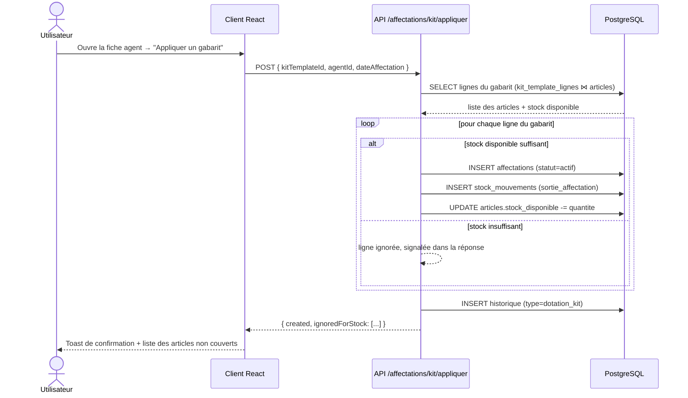
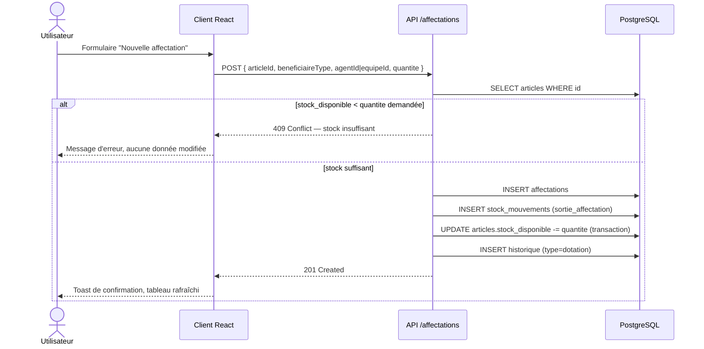
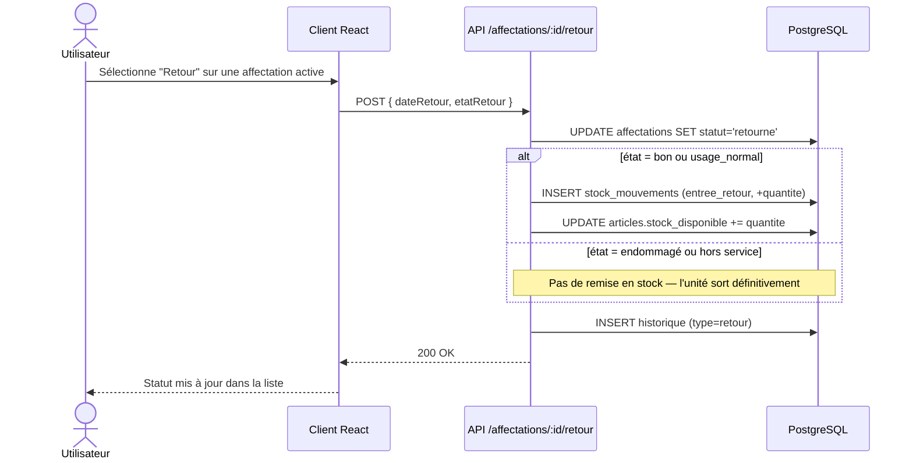

# Diagrammes de séquence — flux métier clés

## 1. Application d'un gabarit de dotation standard à un agent

## 2. Affectation manuelle et contrôle de stock

## 3. Retour d'équipement

Ces trois flux illustrent le principe directeur de l'application : **toute
variation de stock passe par le ledger `stock_mouvements`, et tout événement
métier est journalisé dans `historique`** — rien n'est jamais écrasé ou perdu,
conformément à l'exigence de traçabilité complète du cahier des charges.
