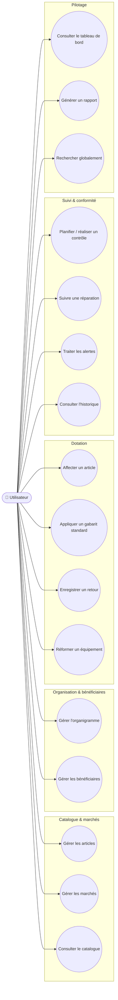

# Cas d'utilisation

Mermaid n'a pas de notation UML "cas d'utilisation" native ; le diagramme
ci-dessous utilise des nœuds arrondis pour les cas d'utilisation et des
sous-graphes pour les acteurs, ce qui reste lisible et proche de la
convention UML.

Application à usage individuel (un seul compte, pas de distinction de rôles) :
tous les cas d'utilisation sont accessibles au même utilisateur une fois
connecté.

## Description des cas d'utilisation clés

| Cas d'utilisation | Déclencheur | Résultat |
|---|---|---|
| Appliquer un gabarit standard | Nouvel agent affecté à une équipe, ou renouvellement de dotation | Génère automatiquement les lignes d'affectation EPI (par agent) ou EPC (par équipe) correspondant au type d'équipe/poste, décrémente le stock, journalise l'historique |
| Affecter un article | Besoin ponctuel (hors gabarit) | Crée une affectation, vérifie le stock disponible, décrémente, journalise |
| Enregistrer un retour | Fin de mission, changement de taille, restitution | Met à jour le statut de l'affectation, remet en stock si l'état le permet |
| Réformer un équipement | Fin de vie, contrôle non conforme, casse | Clôture l'affectation, crée une entrée de réforme, journalise (l'article ne revient jamais en stock) |
| Traiter les alertes | Génération automatique (stock, contrôle en retard, fin de vie, livraison) | Marque comme lue/traitée, oriente vers l'action corrective |
